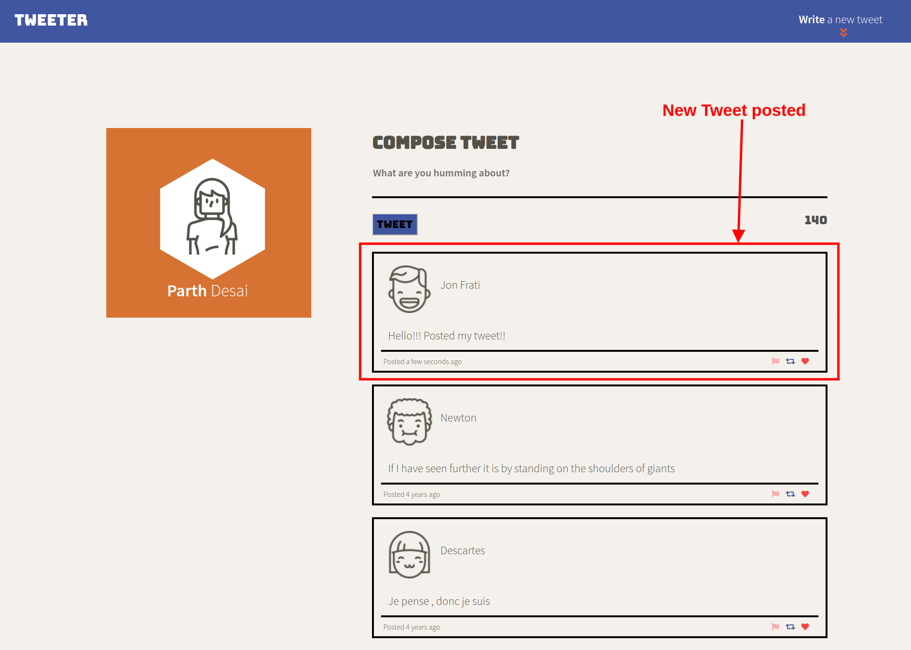

# Tweeter Project

Tweeter is a simple, single-page Twitter clone.

This repository is the starter code for the project: Students will fork and clone this repository, then build upon it to practice their HTML, CSS, JS, jQuery and AJAX front-end skills, and their Node, Express and MongoDB back-end skills.

## Getting Started

1. Fork this repository, then clone your fork of this repository.
2. Install dependencies using the `npm install` command.
3. Start the web server using the `npm run local` command. The app will be served at <http://localhost:8080/>.
4. Go to <http://localhost:8080/> in your browser.

## Final product

This is the home page. User can see previous tweets and can toggle the down arrow found on the top right section to write a new tweet.

##

When a user tries to post an empty tweet, the user gets the error "Cannot post empty tweet".

##

When a user tries to post the tweet that is more than 140 characters, the app gives the error "cannot post more than 140 characters".

##

In this screenshot, user can see the new tweet that is posted. I have also added the moment.js to calculate/display the time ago the tweet was posted.

This screenshot is the Ipad version of the Tweeter app with all/same functionalities as the desktop version.

## Dependencies

- Express
- Node 5.10.x or above
- Body parser
- md5
